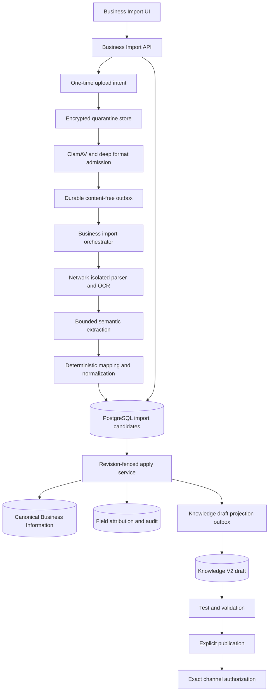
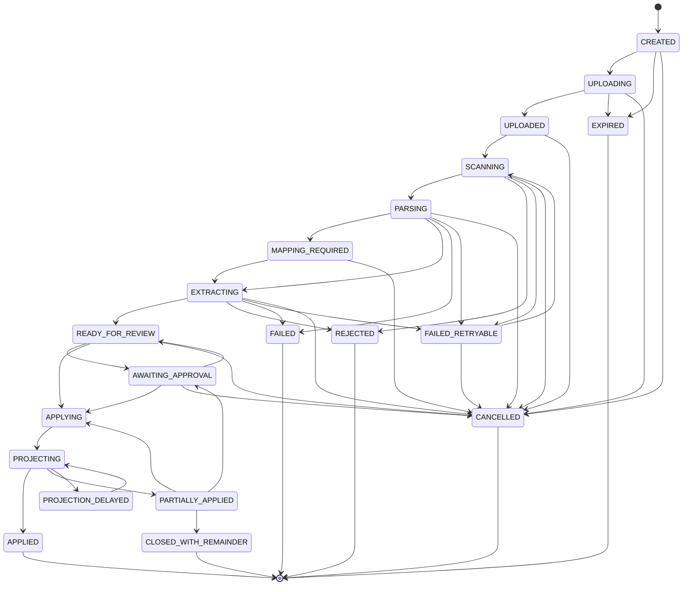

# Business Data File Import Design

Status: proposed target design
Date: 2026-07-21
Scope: structured business information import from XLSX, CSV, and PDF

## 1. Executive decision

LeadVirt should build one client-facing feature named **Import business information**.

The feature is not a generic file uploader. It converts a file into reviewed, structured draft changes to Business Information. It must support services first and use the same engine for identity, locations, hours, FAQ, policies, promotions, and handoff guidance once each target has a proper structured schema.

Hard decisions:

1. Support `.xlsx`, `.csv`, and `.pdf`. Do not support legacy Excel, macro-enabled workbooks, archives, or arbitrary JSON in the client flow.
2. Keep two explicit intents:
   - **Import business information** updates structured business data.
   - **Add reference material** creates a Knowledge document.
3. A file never changes customer answers immediately. It creates staged candidates, then an authorized user reviews and applies an exact diff to the draft.
4. Applying an import updates the canonical Business Information domain first. Knowledge V2 receives a projection from that domain. The importer must not insert standalone facts that are invisible in the Business Information UI.
5. The active publication remains live during upload, processing, review, and draft application. Imported changes reach customers only after testing and explicit publication.
6. Missing rows in a newer file never imply deletion. Removal is a separate explicit archive review.
7. Every imported value retains exact file evidence: CSV row and column, XLSX sheet and range, or PDF page and bounding box.
8. Broad import must not be built on the current JSON-backed `OnboardingState.data` profile. The target requires relational structured Business Information and stable source identities.
9. PDF and XLSX parsing must run in a network-isolated parser sandbox. ClamAV alone is not an adequate parser boundary.
10. Roll out incrementally. Deterministic service imports should ship before arbitrary spreadsheets, native PDFs, and OCR PDFs.

The decisive invariant is:

> Files create reviewed draft proposals, never direct AI truth.

## 2. Current system evidence

The existing product has useful foundations, but it does not currently import services from files.

| Area                                    | Current behavior                                                           | Design consequence                                                                                    |
| --------------------------------------- | -------------------------------------------------------------------------- | ----------------------------------------------------------------------------------------------------- |
| Business Information                    | Reconstructed from `OnboardingState.data`, `Tenant`, and `Tenant.settings` | There is no relational Business Profile aggregate suitable for broad imports                          |
| Services                                | Maximum 200; `name`, `description`, `price`, and `duration`                | Price and duration are strings; no categories, stable external IDs, currency, validity, or provenance |
| Hours                                   | One opening interval for each weekday                                      | No breaks, location-specific hours, holidays, or date exceptions                                      |
| FAQ, policies, availability, escalation | Free-text blobs                                                            | They cannot support reliable row-level import, diff, re-import, or evidence                           |
| TXT/CSV file source                     | Secure upload, then plain-text document extraction                         | CSV columns do not create services or profile fields                                                  |
| XLSX                                    | Unsupported and currently rejected as archive-like content                 | Requires dedicated OOXML admission and parsing                                                        |
| PDF                                     | Explicitly rejected before ingestion                                       | Requires a parser/OCR sandbox and page evidence                                                       |
| Business Profile write                  | `If-Match`, idempotency, tenant lock, one profile revision                 | Reuse this concurrency contract at import apply time                                                  |
| Knowledge V2                            | Review, conflicts, tests, publication, immutable activation                | Reuse governance after canonical Business Information is updated                                      |

The current CSV Knowledge source path must remain available for reference documents, but it must not be presented as structured service import.

## 3. Product objectives

The feature should let a small business reach a usable draft without learning spreadsheet mapping terminology or Knowledge architecture.

Primary outcomes:

- Import a normal price list with minimal clicks.
- Detect what the file contains before asking configuration questions.
- Show an exact old-versus-new diff.
- Make uncertain or risky values obvious and editable.
- Prevent duplicates on repeated imports.
- Preserve existing manual data unless the user approves a specific change.
- Preserve precise source evidence for audit and correction.
- Generate a draft that can be tested and published through the existing Knowledge lifecycle.
- Keep an existing working AI version available throughout the process.

Non-goals:

- Importing live appointment slots, inventory, order state, or customer account state as static facts.
- Uploading customer lists, leads, orders, medical records, credentials, or API keys.
- Automatically publishing model-extracted information.
- Executing spreadsheet formulas, macros, links, queries, or PDF instructions.
- Replacing provider integrations with periodic file uploads.
- Treating a filename as stable record identity.

## 4. Information that files may contain

### 4.1 Target information matrix

`Strong` means deterministic tabular import is expected. `Extract` means the format can be handled but requires evidence-based review. `Wrong source` means a connector or live tool is required.

| Information                                                | XLSX         | CSV          | PDF          | Canonical target              | Risk and review                              |
| ---------------------------------------------------------- | ------------ | ------------ | ------------ | ----------------------------- | -------------------------------------------- |
| Business name, type, description                           | Strong       | Possible     | Extract      | Business identity             | Low; preselect exact values                  |
| Default language, timezone, currency                       | Strong       | Possible     | Extract      | Business defaults             | Confirm timezone and currency                |
| Services, products, menu items                             | Strong       | Strong       | Extract      | Business offering             | New items can be preselected                 |
| Categories and variants                                    | Strong       | Strong       | Extract      | Offering category and variant | Ambiguous hierarchy needs review             |
| Prices, ranges, units, tax notes                           | Strong       | Strong       | Extract      | Offering price                | Explicit confirmation required               |
| Duration and preparation time                              | Strong       | Strong       | Extract      | Offering duration             | Confirm ambiguous units                      |
| Booking or eligibility requirements                        | Strong       | Strong       | Extract      | Offering rule/guidance        | High-risk review                             |
| Public phone, email, website                               | Strong       | Possible     | Extract      | Contact point                 | Confirm visibility                           |
| Locations and addresses                                    | Strong       | Strong       | Extract      | Business location             | Confirm duplicate locations                  |
| Weekly opening hours                                       | Strong       | Strong       | Extract      | Hours rules                   | Explicit confirmation required               |
| Breaks, holidays, date exceptions                          | Strong       | Strong       | Extract      | Hours exceptions              | Dates and timezone required                  |
| FAQ question and answer pairs                              | Strong       | Strong       | Extract      | Structured FAQ                | Low/medium review                            |
| Cancellation, refund, payment, delivery, warranty policies | Strong       | Strong       | Extract      | Typed business policy         | Explicit approval required                   |
| Promotions and temporary offers                            | Strong       | Strong       | Extract      | Promotion                     | Start and end dates required                 |
| Operator handoff and escalation rules                      | Possible     | Possible     | Suggest only | Handoff guidance              | Owner approval and tests required            |
| Public staff biographies and specialties                   | Strong       | Strong       | Extract      | Public team profile           | Later phase; consent and visibility required |
| Long manuals and explanatory articles                      | Weak         | Weak         | Strong       | Knowledge reference document  | Separate `Add reference material` intent     |
| Current inventory or appointment slots                     | Wrong source | Wrong source | Wrong source | Connector/live tool           | Never publish as static truth                |
| Customer, order, lead, account, or medical data            | Reject       | Reject       | Reject       | None                          | Quarantine or reject                         |
| Secrets, passwords, tokens, private keys                   | Reject       | Reject       | Reject       | None                          | Security incident path                       |

### 4.2 Release scope

The target engine is broad, but the product should not expose categories before their canonical schemas are ready.

1. **Release A: deterministic CSV services**
   - LeadVirt CSV template.
   - Services, categories, descriptions, prices, currency, units, duration, and active state.
   - Exact diff, review, attribution, draft apply, test, and publication.
2. **Release B: deterministic XLSX services**
   - LeadVirt XLSX template.
   - The same service contract and review path as CSV.
   - OOXML admission and multi-sheet extraction without manual mapping.
3. **Release C: arbitrary spreadsheets and broader data**
   - Header detection and manual column mapping.
   - Business identity, locations, regular hours, and FAQ.
4. **Release D: native-text PDF**
   - Layout and table extraction with page evidence.
   - Services, prices, FAQ, and policies.
5. **Release E: OCR PDF**
   - Scanned menus and price lists.
   - Strict capacity limits and lower-confidence review.
6. **Release F: advanced business data**
   - Holiday hours, promotions, public team profiles, and handoff proposals.

Do not expose all formats and all categories in one release. PDF OCR is the highest-risk and highest-resource component and should ship last.

## 5. Canonical Business Information model

### 5.1 Required correction before broad import

The current profile is a bounded JSON document with free-text prices, durations, FAQ, policies, and escalation. That model is acceptable for manual pilot setup but not for repeatable bulk import.

Do not solve this by placing larger arrays into `OnboardingState.data` or increasing the 224 KiB limit. That would retain replace-all writes, poor pagination, weak provenance, and whole-profile concurrency conflicts.

Create a relational Business Information v2 aggregate. Logical models follow; exact Prisma naming can match repository conventions.

The product has two deliberately different authorities:

- **Canonical authoring state:** the latest Business Information v2 values shown in the editor. Manual edits and approved imports write here.
- **Serving state:** the immutable active Knowledge publication bound to customer channels. Runtime customer answers never read unreviewed authoring rows directly.

`Apply to draft` means updating canonical authoring state and preparing its Knowledge draft projection. It does not mean changing serving state. LeadVirt does not need a second editable branch, but it does need revisioned application records and a reliable revert operation for unpublished imported changes.

### 5.2 Authoritative records

#### `BusinessInformationState`

- `tenantId`
- monotonically increasing `revision`
- canonical hash
- last actor and update time
- one strong aggregate ETag
- latest successfully projected Knowledge draft revision

The aggregate revision is the import concurrency fence. Child rows may also have row versions for efficient editors, but a completed import advances the aggregate once.

#### `BusinessInformationRevision`

- tenant, revision, parent revision, canonical hash, actor, origin, and timestamp;
- encrypted typed before/after delta for every changed canonical field;
- affected row IDs and row versions;
- import/application references when applicable;
- Knowledge draft and publication references.

This is authoring revision history, not file evidence. Retain a revision delta while current authoring state, a retained publication, or an available revert operation references it. Source-preview expiry cannot delete it. A valid data-deletion operation first creates a tombstone/superseding revision and then removes no-longer-referenced private delta content through the deletion ledger; the product must not promise revert after legally required deletion.

#### `BusinessIdentity`

- display name
- legal or alternate name when required
- business type
- public description
- default locale
- IANA timezone
- default ISO currency

#### `BusinessOffering`

- opaque internal ID
- kind: `SERVICE`, `PRODUCT`, or `MENU_ITEM`
- stable optional external ID
- category and parent category
- name and description
- active/archived state
- locale and location applicability
- booking or preparation notes
- row version

#### `BusinessOfferingPrice`

- offering ID
- type: `FIXED`, `FROM`, `RANGE`, `FREE`, or `ON_REQUEST`
- exact decimal amount or range, never floating point
- ISO currency
- unit such as item, hour, session, or package
- tax display note
- effective start and end

#### `BusinessOfferingDuration`

- minimum and maximum integer minutes
- optional preparation or buffer minutes

#### `BusinessLocation`

- stable optional external ID
- name
- structured and display address
- timezone
- public contact points
- active/archived state

#### `BusinessHoursRule`

- location or tenant scope
- weekday
- one or more opening intervals
- effective dates

#### `BusinessHoursException`

- location scope
- exact date or date range
- closed flag or replacement intervals
- reason displayed to operators

#### `BusinessFaq`

- stable optional external ID
- category
- canonical question
- answer
- locale
- audience
- location/offering scope
- effective dates
- active/archived state

#### `BusinessPolicy`

- stable optional external ID
- type: cancellation, refund, delivery, payment, warranty, eligibility, privacy, or other
- title and policy text
- locale and scope
- effective dates
- whether customer questions require handoff
- approval state

#### `BusinessPromotion`

- stable optional external ID
- name, description, and terms
- applicable offering/location IDs
- price effect
- start and end timestamps
- active/expired state

#### `BusinessHandoffRule`

- trigger and scope
- operator-facing reason
- customer-facing fallback
- destination/team reference
- priority
- approval state

Imported handoff rules are proposals only. They cannot become executable guidance without owner approval and required tests.

### 5.3 Stable source identity

Reliable re-import requires a mapping independent of filename and row number.

Add a binding equivalent to:

```text
tenant + source lineage + entity type + external key -> canonical resource ID
```

Identity priority:

1. Explicit `external_id` from a LeadVirt template or upstream export.
2. Existing binding from the same import source lineage.
3. Deterministic normalized candidate key such as category, name, location, and locale.
4. Human match when more than one existing record is plausible.

Row number is evidence, not identity. Filename is display metadata, not identity.

### 5.4 Provenance

Add field-level attribution linking the current canonical value to:

- import, import revision, candidate, source, and artifact IDs;
- exact evidence locator;
- source value hash;
- parser, OCR, mapper, schema, model, and prompt versions where applicable;
- authority `IMPORTED`;
- actor who approved it;
- extraction confidence band;
- imported and superseded timestamps.

A later manual edit closes the previous attribution rather than deleting it.

### 5.5 Migration and compatibility

Use expand/deploy/backfill/cutover per tenant:

1. Add relational records and readers without removing current fields.
2. Backfill the current profile into relational records with deterministic IDs.
3. Reconcile hashes and field-level fixtures before enabling the v2 editor or imports for that tenant.
4. In one fenced cutover, make v2 the only editable authority and route manual edits and imports through the same domain transaction.
5. Make legacy profile endpoints read-only compatibility views. Project only fields the legacy shape can represent; never round-trip those projections back into v2.
6. Keep `OnboardingState.data`, selected `Tenant` fields, and legacy Knowledge rows as explicitly lossy read compatibility projections while old clients are retired.
7. Block every legacy write path before enabling locations, multiple prices, multiple daily intervals, scopes, or effective dates that the legacy shape cannot represent.
8. Observe reconciliation and compatibility-read metrics, then remove obsolete views in a later release.

There must be only one editable authority at cutover. An import feature flag cannot be enabled for a tenant until its v2 cutover and reconciliation gate pass.

## 6. File contracts

All limits are returned by the server upload policy. The client must not maintain a conflicting hard-coded policy.

### 6.1 Common behavior

- Initial raw-file limit: 10 MiB, matching the existing production boundary.
- One file per import revision.
- Exact filename, declared MIME, byte length, expiry, tenant, actor, and purpose are bound to a one-time upload token.
- Raw artifacts are encrypted and classified `INTERNAL` by default.
- Customer visibility applies to approved extracted fields, not to the raw file.
- Password-protected/encrypted files are rejected.
- No external URLs, fonts, workbook links, or PDF resources are fetched.
- Raw files are never served inline from the application origin.
- Identical artifact hash plus parser/mapping versions may reuse tenant-scoped immutable stage output.

Initial processing controls:

| Limit               |                                 Starting value |
| ------------------- | ---------------------------------------------: |
| Raw file            |                                         10 MiB |
| XLSX sheets         |                                             20 |
| Spreadsheet rows    |                                   10,000 total |
| Spreadsheet columns |                                  100 per table |
| Cell text           |                                          8 KiB |
| Services applied    | 200 until catalog v2 removes the current limit |
| PDF pages           |                                            100 |
| OCR pages           |                                             20 |
| OCR pixels per page |                                     15 million |
| OCR raster output   |                                  50 megapixels |
| OCR raster file     |                                         64 MiB |
| Extracted text      |                           1,000,000 characters |
| Parser wall time    |                                      4 minutes |
| Active OCR imports  |                                   1 per tenant |
| Pending imports     |                                   5 per tenant |

These are launch controls, not permanent plan promises. Tune them using production evidence.

### 6.2 XLSX

Supported MIME:

```text
application/vnd.openxmlformats-officedocument.spreadsheetml.sheet
```

Support only `.xlsx`.

Reject:

- `.xls`, `.xlsm`, `.xlsb`, `.xlam`, and password-protected workbooks;
- VBA, macros, ActiveX, OLE objects, embedded packages, and executable content;
- external workbook relationships, DDE, query connections, and Power Query;
- archive traversal, excessive entries, excessive expansion, and decompression bombs;
- invalid OOXML packages and XML external entities.

Parser behavior:

- Validate the OOXML ZIP package before workbook parsing.
- Parse in a read-only sandbox with no network.
- Never evaluate formulas.
- Permit cached formula values only when clearly marked as formula-derived and requiring confirmation.
- Reject formulas that depend on external workbooks.
- Ignore hidden sheets by default; report that ignored data exists.
- Preserve sheet name, table, row, column, cell range, merged-cell structure, number format, and displayed value.
- Handle the Excel 1900 and 1904 date systems explicitly.
- Treat formula-like text as literal data and neutralize it on later exports.

### 6.3 LeadVirt XLSX template

The downloadable workbook should include a visible `Instructions` sheet and versioned named metadata. Data sheets use stable machine headers with localized human labels and examples.

Recommended sheets:

- `Business`
- `Services`
- `Locations`
- `Hours`
- `FAQ`
- `Policies`
- `Promotions`

The first release only requires `Services`; unused sheets can remain absent.

Recommended `Services` columns:

```text
external_id
category
name
description
price_type
price_amount
price_from
price_to
currency
price_unit
tax_note
duration_minutes
duration_max_minutes
location_external_id
booking_notes
active
valid_from
valid_until
language
```

Rules:

- `external_id` is optional for first import and strongly recommended for re-import.
- `name` is required.
- `price_type` controls which price fields are allowed.
- Money uses decimal text plus ISO currency.
- Dates use ISO 8601.
- Duration uses integer minutes.
- Cross-sheet references use external IDs.
- Example rows are visually distinct and explicitly ignored by the parser.

### 6.4 CSV

Supported MIME:

```text
text/csv
```

CSV represents one logical entity table per file. The upload flow auto-detects the table type and asks only when ambiguous.

Support:

- UTF-8 and UTF-8 BOM;
- Windows-1251 for the Russian market, with a mandatory readable preview before apply;
- comma, semicolon, and tab delimiters;
- quoted delimiters, escaped quotes, and multiline fields;
- CRLF and LF line endings;
- localized header aliases;
- locale-aware decimal interpretation only after currency and locale are known.

Rules:

- Use a real bounded streaming CSV parser. Never split lines or commas manually.
- Require a confirmed header mapping before candidate extraction.
- Treat leading `=`, `+`, `-`, and `@` as literal values.
- Escape formula-like values in future CSV exports.
- Reject inconsistent row widths beyond a small reported tolerance.
- Preserve row and column evidence for every field.

LeadVirt should provide separate CSV templates for Services, Locations, Hours, FAQ, and Policies.

### 6.5 PDF

Supported MIME:

```text
application/pdf
```

PDF import supports arbitrary price lists, menus, catalogs, FAQ sheets, and policy documents. It is evidence extraction, not a deterministic table contract.

Processing modes:

1. Native-text layout and table extraction.
2. OCR for image-only or low-text pages.
3. Mixed mode for documents containing both.

Requirements:

- Parse only in a dedicated network-isolated container.
- Rasterize previews in the sandbox; never embed the original PDF in the product page.
- Preserve page, bounding box, table, row, column, and text hash.
- Detect repeated headers, footers, multi-page tables, rotated pages, and reading order.
- Report unreadable and partially processed pages.
- Keep OCR uncertainty attached to individual values.
- Confirm decimal separators, currencies, date ranges, and crossed-out/old prices.
- Do not interpret PDF instructions as system or model instructions.
- Do not send the raw PDF to an external model.

Native and OCR parsers must be selected through a benchmark using real multilingual LeadVirt price lists, not by package popularity alone.

### 6.6 Unsupported formats

Do not accept these in the initial feature:

- `.xls`, `.xlsm`, `.xlsb`, `.ods`;
- ZIP/RAR/7z archives;
- JSON in the default client flow;
- DOCX and images until separate admission and extraction gates exist.

The UI should state the accepted formats without suggesting that renaming an extension will work.

### 6.7 JSON decision

Do not add arbitrary JSON to the client upload picker in the initial release.

Use JSON internally for the versioned parser manifest, normalized candidates, and service-to-service contracts. Those payloads must validate against strict internal schemas and remain implementation details; internal JSON is not evidence that arbitrary customer JSON is supported.

JSON is a transport format, not a client-friendly business document. Supporting arbitrary objects would require customers to understand LeadVirt's internal schema while creating ambiguous semantics for partial updates, deletion, identifiers, currencies, localization, and future schema changes. It would also expose the unstable current JSON-backed profile as an accidental public contract.

JSON is appropriate later, but one contract must not mix integration updates with restore semantics. Use two distinct contracts:

- **Business Data Batch API v1:** authenticated machine-to-machine upserts identified by stable external IDs. It never infers deletion from omission.
- **LeadVirt Business Snapshot v1:** full logical export and import for migration. Import creates a staged diff. Destructive restore/archive behavior is a separate privileged operation and is never the default.

Neither contract is a database dump. A JSON file picker, if ever exposed, accepts only a LeadVirt-generated snapshot. Technical integrations call the authenticated batch API instead of uploading files.

These capabilities may ship only after all of these conditions are true:

1. Business Information v2 is the canonical relational authority.
2. LeadVirt publishes a stable JSON Schema with an explicit `schemaVersion` and migration policy.
3. Every entity has stable external IDs and exact create/update/archive semantics.
4. The import uses the same staged candidates, evidence, exact diff, authorization, idempotency, and explicit publication path as CSV/XLSX/PDF.
5. LeadVirt can export the same contract, so customers can inspect and round-trip valid data.

The future contracts should use dedicated media types such as `application/vnd.leadvirt.business-batch+json` and `application/vnd.leadvirt.business-snapshot+json`. They reject unknown schema versions, unknown fields outside declared extension points, and unknown mutation semantics. A generic `application/json` upload remains unsupported.

Until that contract exists, technical customers should use the deterministic CSV/XLSX template. Adding JSON earlier creates maintenance debt without improving the primary non-technical onboarding journey.

## 7. Client UX

### 7.1 Entry points

Primary entry:

- `Knowledge -> Business Information -> Import file`

Contextual entry:

- Services section -> `Import price list`

First-run entry:

- Dashboard readiness -> `Upload menu or price list` when service information is missing

Re-import entry:

- Recent import/source -> `Upload updated version`

Sources entry:

- `Add file` first asks:
  - `Update business information`
  - `Add reference material`

Do not silently treat both intents as the same operation.

Onboarding step 4 remains name-only. Bulk import belongs after onboarding.

### 7.2 Route shape

File selection may use a compact modal. Mapping and review require a full page:

```text
/app/knowledge/imports/:importId
```

The full page survives refresh and browser closure. Import state is server-authoritative.

### 7.3 Main flow


#### Screen 1: Choose file

Show:

- drag/drop area and file picker;
- accepted formats and current server limits;
- `Download XLSX template` and `Download CSV template`;
- one sentence: `Changes stay in draft until you publish.`

Do not ask for MIME, source name, classification, audience, parser, locale, or mapping before the file is analyzed. Infer safe defaults and ask only about exceptions.

If the Business Information page has unsaved edits, require `Save and import` or `Discard and import` before leaving.

#### Screen 2: Processing

Show honest server stages:

- Uploading
- Security check
- Reading file
- Recognizing tables
- Preparing changes

The user may leave. Send an in-app notification when review is ready.

Do not fabricate percentage progress. Use counts only when the server has authoritative totals.

#### Screen 3: Mapping, only when required

LeadVirt template files should skip this screen.

For an arbitrary spreadsheet:

- show the detected table and first safe rows;
- map source columns to target fields;
- allow `Ignore column`;
- infer locale, currency, timezone, and units;
- show a plain-language warning for unresolved required fields;
- save confirmed mappings for later revisions of the same source schema.

Do not expose raw confidence percentages. Use `Matched`, `Check mapping`, and `Not used`.

#### Screen 4: Findings summary

Example:

```text
Found 24 services, 7 FAQ entries, and 2 policies.
3 items need attention.
```

Group by business category. Show parse/OCR warnings and unused pages or sheets. If unused narrative content may be useful, offer a separate action to add it as reference material. Do not index it automatically.

#### Screen 5: Review changes

Diff states:

- New
- Updated
- Unchanged
- Possible duplicate
- Conflict
- Invalid
- Missing from new file

Defaults:

- Valid new records are selected.
- Exact duplicates and unchanged records are skipped.
- Safe deterministic updates may be selected.
- Ambiguous matches, prices, hours, policies, promotions, and handoff rules require confirmation.
- Invalid records are unselected.
- Missing records remain untouched.

Approval is separate from selection:

- A manager may select, edit, and submit candidates within their edit permission.
- Candidates requiring stronger approval show `Approval required` and cannot enter an apply batch until an authorized owner/admin approves their exact candidate version.
- Editing an approved candidate invalidates its approval.
- Owners/admins receive one grouped approval request with the proposed diff and safe evidence.
- Rejection requires a reason and returns the candidate to the preparer; low-risk eligible candidates may still be applied separately.

The primary action names the exact effect, for example:

```text
Add 21 and update 4
```

Each value can open its source evidence:

- CSV row and column;
- XLSX sheet and highlighted cells;
- PDF page image with highlighted region.

Users may edit proposed values before apply. Edited values retain both extracted and approved provenance.

#### Screen 6: Apply result

After the canonical transaction commits, show `Preparing draft answers` until Knowledge confirms projection of the exact Business Information revision. Do not enable tests against an earlier draft.

When projection is ready, show:

- added, updated, skipped, and unresolved counts;
- a direct link to affected Business Information sections;
- `Test answers` as the primary next action;
- `Review revert` while the imported revision remains unpublished.

If valid candidates were applied while conflicts or approvals remain, state the split explicitly, for example `18 changes prepared; 3 still need review`. The user can resolve and apply the remaining candidates as another immutable application batch.

A direct revert is allowed only when every affected authoring row still has the version written by that import batch. Otherwise `Review revert` creates a new exact reverse diff so later manual edits or imports cannot be overwritten. Newly added records are archived rather than hard-deleted. After the imported revision has been published, rollback of serving state uses Knowledge History and correction of authoring state uses a reviewed reverse diff.

State explicitly:

```text
The changes are in draft. Customers still receive answers from the published version.
```

#### Screen 7: Test and publish

Generate targeted draft tests from changed records, such as:

- top service price and duration;
- location hours;
- cancellation policy;
- promotion validity;
- handoff behavior.

Publication stays explicit. If automatic replies are currently enabled, the publish confirmation should list affected channels and let an authorized owner explicitly authorize binding those channels to the new exact publication after all gates pass. This avoids an unexplained service interruption without weakening publication-bound authorization.

### 7.4 Review layout

Desktop:

- category and status filters;
- dense editable table;
- old and proposed values side by side;
- evidence side panel;
- sticky summary and primary action;
- bulk selection only for safe homogeneous records.

Mobile:

- one expandable item per row/card;
- no compressed spreadsheet and no page-level horizontal scroll;
- sticky bottom action;
- category/status selector;
- evidence opens full screen;
- at least 44 px touch targets.

### 7.5 Re-import lifecycle

Re-import is a new immutable source revision, not an overwrite.

Show:

- added;
- changed;
- unchanged;
- missing;
- unresolved matches.

Rules:

- Match by external ID, then source lineage, then normalized candidate identity.
- Do not use filename or row position as identity.
- Guaranteed automatic update requires a stable external ID. LeadVirt exports and re-import templates preserve generated external IDs.
- A renamed row without a stable ID becomes `Possible duplicate`; LeadVirt must not silently create it or overwrite the nearest name match.
- Do not delete missing records automatically.
- Represent records absent from the new source revision as informational `Missing` candidates.
- An advanced `Review removals` action converts selected missing bindings into high-risk `Archive` proposals. Archive requires exact review and approval and is not part of the initial CSV/XLSX release.
- An identical artifact and pipeline produces a no-change result.
- If the source schema changed, request mapping confirmation again.
- If Business Information changed while review was open, invalidate the stale apply preview and rebase the diff.

### 7.6 Errors and recovery

Every failure needs one plain-language cause and one valid next action.

| Failure                              | Client behavior                                            |
| ------------------------------------ | ---------------------------------------------------------- |
| Malware or active content            | Reject file; do not offer retry with the same artifact     |
| Password-protected file              | Ask for an unprotected export                              |
| Unsupported workbook feature         | Name the feature and request CSV/XLSX without it           |
| Parser unavailable                   | Preserve upload and retry later                            |
| OCR partial failure                  | Review readable pages; list unreadable pages               |
| Ambiguous mapping                    | Open mapping screen                                        |
| Invalid values                       | Keep valid candidates; isolate invalid rows                |
| Profile changed concurrently         | Rebase and show new conflicts                              |
| Permission revoked                   | Stop work and require an authorized member                 |
| Quota exceeded                       | Show the exact limit and how to reduce the file            |
| Apply committed but dispatch delayed | Show saved draft; background projection remains observable |

### 7.7 Accessibility and localization

- Full keyboard operation for upload, mapping, table review, evidence, and confirmation.
- Visible focus and a focused error summary after validation.
- Status text in addition to color.
- `aria-live` updates for processing and apply completion.
- Reduced-motion support.
- Localized header aliases for EN, RU, ES, FR, DE, and PT.
- Locale-aware preview of money, dates, times, and decimal separators.
- Original business content remains verbatim; locale switching changes only system UI.
- Long filenames, headers, and values wrap or truncate with an accessible full value.

### 7.8 Details hidden from normal users

Do not expose these in the primary flow:

- MIME type;
- hashes;
- object keys;
- parser or model names;
- embeddings and chunks;
- job IDs and internal error codes;
- raw confidence percentages;
- authority enums;
- idempotency keys;
- technical audience and classification controls.

Advanced support tooling may expose safe IDs and versions to authorized operators.

## 8. Mapping, normalization, and risk policy

### 8.1 Mapping priority

1. Exact LeadVirt template and schema version.
2. Previously confirmed mapping for the same source lineage and table schema hash.
3. Deterministic localized header aliases.
4. User-confirmed column mapping.
5. Deterministic PDF table/text extraction.
6. Schema-constrained model extraction for ambiguous prose only.

Do not use a general model for ordinary spreadsheet rows.

### 8.2 Normalization

Normalize without discarding source evidence:

- Unicode normalization and bounded whitespace cleanup;
- exact decimal money plus ISO currency;
- explicit price type;
- integer minutes for duration;
- ISO dates and timestamps;
- IANA timezone;
- normalized weekday codes;
- public phone/email/web address validation;
- explicit locale and audience;
- deterministic identity keys;
- exact source-value hash.

Do not infer a currency from a symbol when more than one currency is plausible. Do not turn `from 100` into fixed `100`. Do not interpret an absent price as free.

### 8.3 Internal confidence bands

Internally retain calibrated confidence per field and extractor version. The UI uses bands:

- `CONFIRMED_FORMAT`: exact validated template or explicit user mapping;
- `HIGH`: deterministic parse with unambiguous value;
- `MEDIUM`: plausible mapping or OCR that requires confirmation;
- `LOW`: ambiguous, incomplete, or conflicting; unselected by default.

Confidence never overrides risk policy.

### 8.4 Risk defaults

| Data                                | Default risk | Apply behavior                                         |
| ----------------------------------- | ------------ | ------------------------------------------------------ |
| Names and descriptions              | Low          | May be preselected                                     |
| FAQ                                 | Low/medium   | Preselect exact tabular values; review extracted prose |
| Contacts and locations              | Medium       | Confirm customer visibility                            |
| Hours and duration                  | Medium       | Confirm normalized units/timezone                      |
| Prices, promotions, eligibility     | High         | Version-bound owner/admin approval                     |
| Policies                            | High         | Version-bound owner/admin approval                     |
| Handoff/escalation                  | High         | Owner approval and tests                               |
| Customer or regulated personal data | Prohibited   | Reject/quarantine                                      |

## 9. System architecture

### 9.1 Component flow



### 9.2 Reused foundations

Reuse:

- authenticated tenant and permission context;
- one-time upload intent pattern;
- encrypted object store;
- approved ClamAV admission;
- tenant/source/artifact/generation fences;
- PostgreSQL jobs, attempts, outbox/inbox, BullMQ retry, and DLQ contracts;
- Knowledge evidence, review, conflict, test, evaluation, publication, and rollback infrastructure;
- Business Profile idempotency and `If-Match` behavior;
- current immutable publication activation.

Do not duplicate these controls in a second weaker pipeline.

### 9.3 Required components

1. Shared secure-upload core separated from document-source finalization.
2. Business Import API and orchestration module.
3. XLSX OOXML admission inspector.
4. Bounded streaming CSV parser.
5. Network-isolated document parser/OCR service.
6. Versioned semantic extraction contract.
7. Deterministic mapping and normalization engine.
8. Optional constrained extraction-model adapter.
9. Import, mapping, candidate, decision, evidence, attribution, and quota tables.
10. Dedicated parse, map, and cleanup queues.
11. Diff/apply service integrated with canonical Business Information.
12. Generic Business Information to Knowledge projection carrying import provenance.
13. Import health, metrics, dashboards, alerts, cleanup, and operator redrive.

### 9.4 Import state machine



Candidate review and approval are subordinate states, so an import may still have eligible low-risk candidates while other candidates await approval. `PARTIALLY_APPLIED` means at least one immutable application batch is projected and testable while unresolved candidates remain. Closing the remainder never reverses applied changes.

Cancellation increments the import generation and actively terminates sandbox work. Late work with an older generation becomes stale and cannot commit. Cancellation is accepted from every pre-commit state. Once the apply transaction obtains its lock, either cancellation wins before mutation or the atomic application wins and the API returns the committed result; it never claims cancellation after data was applied. `PROJECTING` cannot be cancelled because the canonical revision already committed and its durable projection must finish.

### 9.5 Parser sandbox

The parser service receives bytes or a bounded stream, not database/object-store credentials.

Required controls:

- no internet, DNS, cloud metadata, or application network access;
- non-root user;
- read-only root filesystem;
- ephemeral bounded `tmpfs`;
- no host file mounts;
- dropped capabilities and no privilege escalation;
- seccomp/AppArmor or equivalent policy;
- CPU, memory, PID, file, expanded-byte, output, and wall-clock limits;
- pinned image digest and dependency inventory;
- preloaded OCR/model artifacts;
- startup checks for every required binary and configured OCR language;
- strict input and output schemas;
- one process/import isolation boundary;
- one monotonic request deadline propagated as the remaining subprocess budget;
- safe process-group termination on timeout or client cancellation;
- metadata-only duration, count, and stable error-code logs.

Parser choice is an adapter decision. Benchmark candidate parsers against real LeadVirt multilingual PDFs and tables before selecting the production default.

### 9.6 Versioned extraction contract

The sandbox returns a bounded immutable manifest containing:

- artifact hash and format;
- sheets/pages and safe metadata;
- headings, paragraphs, lists, tables, rows, columns, and cells;
- text/value hashes and encrypted excerpt references;
- CSV row/column, XLSX sheet/range, or PDF page/bounding-box locators;
- language and parse confidence;
- coverage, warnings, ignored content, and unreadable regions;
- parser/OCR contract version.

Queue payloads contain only IDs, hashes, generations, stage metadata, and safe counts. Full extracted content remains encrypted.

### 9.7 Import domain records

#### `BusinessImport`

- tenant and actor;
- purpose and format;
- state, generation, and ETag;
- source, artifact, and parsed revision IDs;
- artifact hash;
- base Business Information revision/hash;
- selected categories;
- parser, OCR, mapper, schema, model, and prompt versions;
- safe count/quality summary;
- failure code and retryability;
- expiry, cancellation, review, and apply times.

#### `BusinessImportSource`

- tenant and immutable source-lineage ID;
- user-visible name and declared upstream system;
- latest artifact/import revision;
- last confirmed schema hash and mapping revision;
- stable source bindings and lifecycle state.

Renaming a source or uploading a new filename does not change lineage. Combining two upstream catalogs requires an explicit merge decision.

#### `BusinessImportMapping`

- import/source table key and schema hash;
- header row and target category;
- column-to-field mapping;
- locale, currency, timezone, and unit defaults;
- mapping revision/ETag;
- actor who confirmed ambiguity.

#### `BusinessImportCandidate`

- deterministic candidate key;
- category and semantic target key;
- proposed `ADD`, `UPDATE`, `UNCHANGED`, `CONFLICT`, `INVALID`, `MISSING`, or explicit `ARCHIVE` action;
- normalized proposed value;
- current target ID and fingerprint;
- risk and confidence band;
- validation/reason codes;
- decision: pending, accepted, edited, submitted for approval, rejected, stale, or applied;
- candidate version/ETag.

`MISSING` is informational and never applyable. `ARCHIVE` exists only after an authorized user explicitly starts removal review for selected missing source bindings.

#### `BusinessImportCandidateApproval`

- candidate ID and exact candidate version/value hash;
- required permission and risk reason;
- state: pending, approved, or rejected;
- requester, approver, decision time, and safe reason;
- approval ETag and audit reference.

Any candidate edit, remap, rebase, or source revision invalidates the previous approval. The same actor may approve only when current policy permits it; the data model also supports future maker-checker separation.

#### `BusinessImportCandidateEvidence`

- artifact and parsed revision;
- semantic element/table IDs;
- precise file locator;
- excerpt hash and encrypted excerpt reference;
- extraction versions.

#### `BusinessInformationAttribution`

- canonical resource and field path;
- current value hash;
- import/candidate/source/artifact/revision references;
- authority, confidence, actor, and imported time;
- superseded time.

#### `BusinessImportApplication`

One record per atomic apply or revert batch:

- import, selected candidate versions, preview manifest, actor, and idempotency key;
- base and resulting Business Information revisions/hashes;
- reference to the durable `BusinessInformationRevision` before/after delta;
- affected canonical row IDs and resulting row versions;
- Knowledge projection outbox identity and exact projection receipt;
- state: committed, projecting, ready, projection delayed, reverted, or superseded;
- publication reference if the resulting draft was later published.

This record powers apply replay, partial apply, exact status, audit, and safe revert. Reverse data belongs to authoring revision history and is retained independently from expiring source evidence.

#### `BusinessImportQuotaReservation`

Reserve atomically before expensive work:

- raw and expanded bytes;
- sheets, rows, columns, and cells;
- PDF and OCR pages/pixels/seconds;
- extracted characters;
- candidates;
- optional model tokens;
- retained storage.

Release reservations on cancellation, expiry, rejection, and permanent failure.

### 9.8 Candidate diff and apply

`Apply preview` freezes:

- exact candidate IDs and ETags;
- decisions and edited values;
- exact approval IDs and approved candidate value hashes where required;
- current Business Information ETag;
- adds, updates, skips, conflicts, and validation results;
- quota impact;
- a short-lived actor/tenant-bound manifest hash.

`Apply` requires:

- import ETag;
- Business Information `If-Match`;
- apply-preview manifest hash;
- idempotency key.

The server locks import and business aggregate rows in a stable order, recomputes the exact diff, and commits the selected valid subset atomically:

1. canonical Business Information records;
2. source bindings and field attribution;
3. one aggregate revision advance;
4. Knowledge draft projection outbox;
5. import candidate terminal decisions;
6. immutable `BusinessImportApplication` before/after evidence;
7. import `PROJECTING` state;
8. content-free audit evidence.

No partial canonical mutation is visible. A stale business revision invalidates the preview and requires rebase.

The import reaches `APPLIED` only after the projection worker records a receipt proving that the exact resulting Business Information revision is present in the current Knowledge draft. If unresolved candidates remain it reaches `PARTIALLY_APPLIED` instead. Tests are disabled while the application is `PROJECTING` or `PROJECTION_DELAYED`.

If projection dispatch fails after commit, the authoring state remains saved, the prior serving publication remains active, and the durable outbox retries. The UI says `Changes saved; draft answers are still being prepared`. The API must not report either a false failed save or a testable draft.

Revert uses a separate preview and apply transaction. Direct reverse apply requires every affected canonical row to match the version produced by the application batch. If any row changed, the server rebases the reverse patch into ordinary candidates and requires conflict review. Revert advances the aggregate revision, writes attribution and a new projection outbox, and archives newly added records rather than deleting audit history.

### 9.9 Knowledge projection

Imported canonical records project to item-level Knowledge data:

- offering identity, price, currency, unit, duration, scope, and validity become structured facts;
- regular hours and exceptions become timezone-bound facts;
- FAQ becomes structured answer facts;
- policies and handoff behavior become guidance versions;
- every projected item carries `authority = IMPORTED` and file evidence;
- verification status follows actor permission and field risk;
- conflicts and high-risk items remain publication blockers until resolved.

Do not flatten all imported services into one catalog summary. Keep the summary only as a compatibility projection while current consumers are migrated.

The raw artifact is not a retrievable document by default. If the user explicitly chooses to retain unused narrative content as reference material, create a separate Knowledge document revision with its own review and publication path.

### 9.10 Publication and channels

- Import processing and apply never move the active publication pointer.
- Draft validation evaluates the exact changed manifest.
- Publication remains owner/admin controlled and compare-and-swap fenced.
- A failed candidate leaves the previous publication live.
- Automatic replies remain bound to an exact publication and channel fingerprint.
- A publish confirmation may create a durable, explicit channel-rebind authorization for named channels. It executes only after the exact candidate publication becomes active and all reply-readiness gates still pass.
- Any mismatch leaves automatic replies off and shows one clear corrective action.

## 10. API surface

Recommended client contract:

```text
GET    /business-profile/import-templates
POST   /business-profile/imports/intents
PUT    /business-profile/imports/:importId/content
POST   /business-profile/imports/:importId/finalize
GET    /business-profile/imports
GET    /business-profile/imports/:importId
GET    /business-profile/imports/:importId/candidates
PATCH  /business-profile/imports/:importId/mappings/:mappingId
PATCH  /business-profile/imports/:importId/candidates/:candidateId
POST   /business-profile/imports/:importId/decisions/bulk
POST   /business-profile/imports/:importId/approval-requests
POST   /business-profile/imports/:importId/approvals/:approvalId/decision
POST   /business-profile/imports/:importId/archive-proposals
POST   /business-profile/imports/:importId/rebase
POST   /business-profile/imports/:importId/apply-preview
POST   /business-profile/imports/:importId/apply
GET    /business-profile/imports/:importId/applications
POST   /business-profile/imports/:importId/applications/:applicationId/revert-preview
POST   /business-profile/imports/:importId/applications/:applicationId/revert
POST   /business-profile/imports/:importId/retry
POST   /business-profile/imports/:importId/cancel
POST   /business-profile/import-sources/:sourceId/revisions
```

Contract rules:

- The intent response is `private, no-store`.
- The browser uploads directly to the issued credential-free transport; Next never buffers file bytes.
- Mutation endpoints require an idempotency key.
- Mutable import resources expose strong ETags.
- Apply requires both import and Business Information concurrency evidence.
- Approval binds to an exact candidate version and value hash; candidate edits invalidate it.
- Import/application status identifies the exact projected Business Information revision. `Test answers` remains unavailable until its projection receipt exists.
- Revert uses the same preview, ETag, idempotency, permission, attribution, and projection contracts as forward apply.
- Lists are cursor-paginated.
- Status errors use stable safe codes and field/row/cell references.
- Raw content and upload tokens never enter durable idempotency responses.
- Processing status should use SSE with `Last-Event-ID`, with bounded polling fallback.

## 11. Queue and recovery architecture

Do not run OCR under the current generic short Knowledge ingestion timeout.

Dedicated work types:

```text
business.import.parse
business.import.map
business.import.cleanup
```

Controls:

- one parse/OCR task per tenant and initially one OCR task per VPS;
- tenant-fair mapping concurrency;
- queue-specific bounded timeouts;
- durable content-free outbox events;
- attempt, heartbeat, lock expiry, generation, retry, DLQ, and redrive behavior;
- low-priority cleanup and orphan reconciliation.

Recovery invariants:

- Replaying intent, finalize, mapping, decisions, preview, or apply returns the same durable result.
- Same artifact plus parser/mapper/schema versions can reuse immutable stage output within one tenant.
- Output objects are written before database references; orphan reconciliation deletes unreferenced output after crashes.
- Retry resumes from the last verified immutable stage.
- Permanent malformed/security failures require a replacement file.
- Apply replay returns the already-applied business revision.
- Cancellation advances generation so late work cannot commit.
- Failed/cancelled/expired imports release quotas and enter retention cleanup.
- Malicious bytes are deleted promptly while retaining content-free audit proof.

## 12. Security and privacy

Security gates in order:

1. Authorize tenant, actor, purpose, plan, quota, and format.
2. Bind exact file policy to a one-time token.
3. Store encrypted bytes in quarantine.
4. Validate byte count and compute SHA-256.
5. Require fresh production-approved ClamAV; fail closed.
6. Inspect OOXML/PDF structure for active content and bombs.
7. Parse only in the isolated sandbox.
8. Validate bounded parser output against a strict schema.
9. Scan extracted text, OCR, hidden content, metadata, and links for secrets, PII, suspicious instructions, and prohibited data.
10. Map only to allowlisted business fields.
11. Require human review and target-specific approval.
12. Project only accepted canonical records into the draft.

Additional rules:

- Treat all document text as untrusted data, never instructions.
- External extraction models receive only minimized, post-classification elements, not the raw file.
- External provider use requires approved processing terms, region, retention, no-training, deletion, and tenant policy.
- No parser receives application, database, object-store, OpenAI, Telegram, or SMTP credentials.
- Raw artifacts default to internal classification even when extracted values become public.
- Detect likely customer lists, orders, credentials, private employee data, and regulated records before any external provider call.
- Audit uses IDs, hashes, versions, safe counts, outcomes, and actor identity. Normal logs and metrics contain no filename, tenant name, cell value, document text, or secret.
- Retention and deletion remove raw, extracted, preview, and vector artifacts through a durable deletion ledger.

Evidence has two layers:

1. **Immutable attribution metadata:** artifact/value hashes, locator, parser/schema versions, actor, decision, and application revision remain as content-free audit proof.
2. **Viewable source evidence:** encrypted excerpts, cells, and safe page rasters follow the tenant retention policy and are deleted when that policy or a valid deletion request requires it.

Immutability means an evidence record cannot be rewritten to support a different value; it does not mean source bytes are retained forever. After viewable evidence expires, the UI shows `Source preview expired` and retains attribution metadata. Canonical approved values remain governed by Business Information retention. Security-rejected files are deleted immediately and never become reviewer-visible evidence.

ClamAV is necessary but not sufficient. File parsing remains a separate exploit and resource-exhaustion boundary.

## 13. Permissions

Use explicit permissions rather than scattering role checks.

| Action                                                   | Required capability                                   |
| -------------------------------------------------------- | ----------------------------------------------------- |
| View import status and applied summary                   | Read Business Information                             |
| Upload and analyze                                       | Edit Business Information plus file-import permission |
| Confirm mapping and edit candidates                      | Edit Business Information                             |
| View redacted candidate evidence needed for review       | Edit Business Information                             |
| Apply low/medium-risk draft changes                      | Edit Business Information                             |
| Approve high-risk price/policy/handoff/archive candidate | Approve Business Information                          |
| Revert an unpublished import application                 | Edit Business Information                             |
| Publish                                                  | Existing Knowledge publish permission                 |
| Rebind automatic replies                                 | Existing channel-secret/activation permission         |
| View or download the full raw artifact                   | Restricted evidence permission                        |
| Retry/redrive failed infrastructure work                 | Operator permission                                   |

Managers may prepare and apply normal draft changes. Owner/admin approval and publication remain the final gate for high-risk customer-visible behavior.

The review permission always includes the minimum post-classification, redacted evidence required to make that decision. A candidate whose evidence cannot be shown safely is rejected or escalated; LeadVirt must not ask a reviewer to approve a value they cannot inspect. Full raw artifact access remains separately restricted and is never required for the ordinary client workflow.

Every background stage revalidates current tenant membership and import generation before committing.

## 14. Observability and operational controls

Bounded-label metrics:

- imports by format, stage, result, and safe error class;
- queue oldest age and stage duration;
- parser/OCR duration and sandbox failures;
- pages, OCR pages, sheets, rows, cells, and candidate histograms;
- candidates by category, risk, diff state, and decision;
- unresolved mappings and low-confidence item counts;
- quota rejection and reservation leakage;
- retries, DLQ, cancellation, and stale-preview counts;
- apply duration and concurrency conflicts;
- import-to-test and import-to-publication conversion;
- time from upload to review, apply, and publication;
- re-import duplicate and no-change ratios;
- operator redrive and cleanup backlog.

Do not use tenant, user, filename, source value, URL, prompt, document text, or error message as a metric label.

Initial SLO candidates:

| SLO                                                 | Initial target                    |
| --------------------------------------------------- | --------------------------------- |
| Template CSV/XLSX ready for review                  | p95 under 2 minutes within limits |
| Native PDF ready for review                         | p95 under 5 minutes within limits |
| Import apply success excluding validation conflicts | at least 99%                      |
| Apply atomicity                                     | zero partial canonical mutations  |
| Provenance coverage                                 | 100% of imported applied fields   |
| Active publication interruption during import       | zero                              |
| Cross-tenant evidence exposure                      | zero                              |
| Security hard-gate failures in adversarial suite    | zero                              |

Alert on parser unavailability, queue age, OCR failure spikes, DLQ growth, quota leakage, cleanup backlog, and attribution gaps.

## 15. Testing strategy

### 15.1 Format fixtures

- LeadVirt CSV and XLSX templates in all six UI locales.
- Arbitrary header aliases and column orders.
- Comma/semicolon/tab CSV, quoted newlines, BOM, Windows-1251, malformed rows.
- XLSX merged cells, hidden sheets, formulas, cached values, 1900/1904 dates, decimal commas.
- Native/scanned/mixed PDFs, rotation, multi-page tables, repeated headers, crossed-out prices, poor OCR.
- Mixed languages and currencies.

### 15.2 Adversarial fixtures

- traversal and Unicode filename attacks;
- ZIP/decompression bombs and excessive OOXML entries;
- macros, ActiveX, OLE, external links, DDE, queries, XXE;
- CSV formula injection;
- encrypted, malformed, active-content, and polyglot PDFs;
- oversized images and OCR denial of service;
- prompt injection and hidden instructions;
- secrets, customer lists, medical data, and restricted PII;
- parser crash, timeout, memory pressure, and invalid output schema.

### 15.3 Domain correctness

- Exact money, currency, unit, duration, timezone, and date normalization.
- Stable external identity and duplicate suppression.
- No deletion from missing rows.
- Ambiguous matches become conflicts.
- Evidence locator accuracy for every field.
- Manual candidate edits preserve extracted and approved values.
- High-risk approval behavior.
- Partial selected-subset apply with unresolved records retained.
- Business Information and Knowledge projection equivalence.

### 15.4 Reliability and isolation

- Actor revocation between every stage.
- Concurrent imports and manual Business Information edits.
- Stale mapping, candidate, preview, and Business Information ETags.
- Duplicate dispatch and apply replay.
- Quota races.
- Cancellation, retry, DLQ, redrive, and late result fencing.
- Crash after object write, parse output, candidate commit, apply commit, and outbox dispatch.
- Tenant isolation in database, object store, parser requests, evidence, cache, and UI.
- Retention and deletion reconciliation.

### 15.5 Browser acceptance

- Upload, leave, return, and resume.
- Template import without mapping.
- Ambiguous mapping.
- Desktop diff table and mobile item cards.
- Evidence for CSV, XLSX, and PDF.
- Exact apply summary.
- Concurrent-edit rebase.
- Retryable and permanent errors.
- Cancellation and undo.
- Draft test and publication handoff.
- Keyboard, screen reader, focus, reduced motion, localization, and no global overflow.

### 15.6 Production gates

- Real PostgreSQL, Redis, object store, ClamAV, parser sandbox, and Qdrant path.
- Parser sandbox proves no internet, metadata endpoint, host filesystem, application credentials, or excessive resources.
- Pinned parser/OCR image and dependency inventory.
- Capacity test at every configured limit.
- Shadow/canary comparison before tenant rollout.
- No production enablement until raw admission, post-parse classification, provenance, review, test, publication, deletion, and operator recovery all pass.

## 16. Rollout and implementation order

### Phase 0: domain and security foundation

- Add relational Business Information v2 and compatibility migration.
- Add import/candidate/evidence/attribution/quota schema.
- Refactor secure upload into a reusable core.
- Add feature flags by tenant and format.
- Add parser service contract and isolated deployment.

### Phase 1: LeadVirt CSV services

- Template download.
- Streaming parser and deterministic mapping.
- Service diff/review/apply.
- Field provenance.
- Item-level Knowledge projection.
- Draft tests and explicit publication.

### Phase 2: LeadVirt XLSX services

- OOXML admission.
- Template workbook and multi-sheet parser.
- Manual column mapping.
- Re-import and source bindings.

### Phase 3: arbitrary spreadsheets and broader data

- Header aliases and remembered mappings.
- Identity, locations, contacts, hours, and FAQ schemas.
- Category-specific review and tests.

### Phase 4: native PDF

- Parser benchmark and pinned sandbox.
- Page/table evidence and safe raster preview.
- Services, FAQ, and policy candidates.

### Phase 5: OCR PDF

- Local OCR artifacts and capacity controls.
- Page-level partial failure.
- Calibrated confidence thresholds.
- Tenant allowlist and measured canary.

### Phase 6: advanced lifecycle

- Holiday hours, promotions, and public team data.
- Handoff proposals and required tests.
- Explicit publish-and-rebind workflow.
- Import mapping administration and operator diagnostics.

## 17. Acceptance criteria

### 17.1 Phase release gates

Each phase ships only when its own gate passes; later formats do not block a safe earlier release.

#### Phase 0: domain and security foundation

- Business Information v2 is the only editable authority for enabled tenants; legacy views are read-only and reconciliation proves the cutover.
- Customer-answer runtime reads only an immutable active Knowledge publication, never live authoring rows.
- Import, source binding, candidate, approval, application, attribution, quota, and deletion records enforce tenant isolation and concurrency.
- The parser service passes network, credential, filesystem, resource-exhaustion, cancellation, and stale-result isolation tests.

#### Phase 1: LeadVirt CSV services

- A compliant template produces exact typed service, price, currency, unit, and duration candidates with row/column evidence.
- High-risk candidates require approval of the exact candidate version; eligible low-risk subsets can apply without losing unresolved work.
- Apply stays `PROJECTING` until the exact Business Information revision has a Knowledge draft receipt; testing cannot start earlier.
- Identical re-import is no-change. Stable external IDs update existing services. Ambiguous renamed rows become conflicts and never silent duplicates.
- Cancellation works in every pre-commit stage; retry and replay are idempotent; an unpublished application has a concurrency-safe revert preview.
- Desktop and mobile complete upload, review, partial apply, projection wait, test, publish, and Telegram-answer acceptance in all supported UI locales.

#### Phase 2: LeadVirt XLSX services

- The template reaches the same canonical result as equivalent CSV without asking for manual mapping.
- OOXML bombs, macros, active content, external links, queries, encryption, formulas without trusted cached values, and malformed packages fail closed.
- Sheet/range evidence, hidden-sheet reporting, limits, and sandbox behavior pass golden and adversarial workbooks.

#### Phase 3: arbitrary spreadsheets and broader data

- Ambiguous headers require saved user mapping and never map silently.
- Identity, contacts, locations, hours, and FAQ have typed canonical schemas, category-specific validation, and safe re-import behavior.
- V2-only fields cannot be lost through any legacy write path.

#### Phase 4: native-text PDF

- A benchmark over representative multilingual LeadVirt documents meets field accuracy and evidence-locator thresholds defined before rollout.
- Every extracted value has page/region evidence; unreadable or unused regions are explicit; raw PDFs never reach an external model.
- Partial extraction cannot create an apparently complete or automatically approved catalog.

#### Phase 5: OCR PDF

- OCR uncertainty remains field-specific and forces confirmation where thresholds require it.
- Raster, page, time, concurrency, cancellation, and tenant-fair capacity limits pass load and denial-of-service tests.
- Canary quality, queue latency, support rate, and correction rate remain within predeclared rollout thresholds.

#### Phase 6: advanced lifecycle

- Missing rows remain informational until an authorized user explicitly creates archive proposals; archive is version-bound, approved, audited, and reversible through ordinary authoring history.
- Holiday hours, promotions, public team data, and handoff proposals have structured schemas and target-specific tests.
- Publish and automatic-reply rebind operate only on the exact tested active publication.

Future JSON contracts have a separate gate: stable v2 schema, published version policy, batch-upsert and snapshot semantics kept distinct, staged review, exact IDs, and round-trip export. They are not part of the file-import launch.

### 17.2 Complete-feature criteria

The complete multi-format feature is done only when all statements are proven:

1. A client can import a compliant CSV, XLSX, or native/scanned PDF from Business Information.
2. LeadVirt detects supported information and asks for mapping only when necessary.
3. Services, prices, durations, locations, hours, FAQ, policies, promotions, and approved handoff rules map to structured canonical records rather than text blobs.
4. Every applied field has immutable attribution metadata and actor attribution; safe source evidence is viewable for its declared retention period and deletion is provable.
5. Re-import deterministically updates stable IDs, treats ambiguous identity as conflict, prevents silent duplicates, and never deletes absent rows automatically.
6. A concurrent manual edit cannot be overwritten by a stale import or revert preview.
7. Version-bound approval, partial apply, remaining-candidate review, explicit archive proposals, and safe revert are proven.
8. Imported authoring changes cannot be tested until their exact draft projection is ready and cannot reach customers until explicit publication gates pass.
9. The previous publication remains active through processing, projection delay, and failed publication.
10. Automatic replies bind only to an explicitly authorized exact active publication.
11. Malware, active content, parser exploits, bombs, secrets, and prohibited personal data fail closed.
12. Parser/OCR work is isolated, cancellable before commit, quota-bound, observable, recoverable, and fenced against late results.
13. Desktop and mobile review remain usable without global overflow or hidden actions.
14. All six supported UI locales pass mapping, review, approval, evidence, error, partial-apply, and revert flows.
15. Production acceptance proves the complete upload-to-authoring-to-projection-to-test-to-publication-to-Telegram-answer path.

## 18. Product risks

| Risk                             | Consequence                                | Control                                       |
| -------------------------------- | ------------------------------------------ | --------------------------------------------- |
| Building on current JSON profile | Rewrite after first serious catalogs       | Relational Business Information v2 first      |
| Treating CSV as text             | AI can quote data but UI cannot manage it  | Separate structured import pipeline           |
| Auto-indexing the raw file       | Duplicate/conflicting truths               | Raw artifact is provenance only by default    |
| Silent replacement mode          | Destructive client data loss               | Exact diff and no inferred deletion           |
| Filename-based identity          | Duplicate services after re-import         | External ID and source lineage binding        |
| Free-text prices                 | Incorrect comparisons and answers          | Exact decimal, currency, type, unit, validity |
| Running PDF parser in API/worker | Remote code execution or outage            | Network-isolated bounded sandbox              |
| Shipping OCR too early           | High support cost and false prices         | Benchmark, allowlist, evidence, confirmation  |
| Model-led spreadsheet parsing    | Non-determinism and cost                   | Deterministic parsers first                   |
| Exposing infrastructure fields   | Confusing setup and unsafe defaults        | Infer defaults; exception-based review        |
| Applying directly to Knowledge   | Business UI and AI disagree                | Canonical Business Information write first    |
| Auto-publishing                  | Customer-visible incorrect prices/policies | Draft, test, explicit publication             |

## 19. Final recommendation

Build the engine generically, but ship services first.

The correct first client journey is:

```text
Import price list -> review exact services and prices -> apply to draft
-> test customer questions -> publish -> verify Telegram replies
```

Do not start with PDF OCR or broad free-form extraction. First establish the canonical structured model, stable re-import identity, evidence, diff/apply transaction, and publication boundary using deterministic CSV/XLSX templates. PDF then becomes another evidence extractor feeding the same safe candidate workflow rather than a separate unreliable feature.
